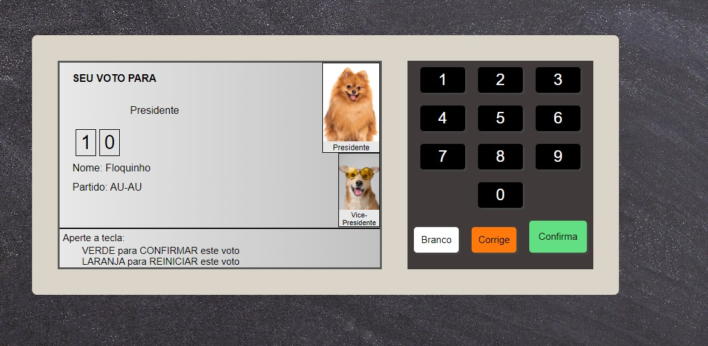

# Projeto - Urna Eletrônica

Este projeto é baseado na lógica do sistema de votação brasileira, a urna eletrônica. Fazendo um uso de JSON para armazenar seus candidatos, imagens e legendas, para que fossem adicionadas no seu local correto.

## Funcionalidades

- Digitar números de candidatos.
- Votar em branco.
- Corrigir o seu voto.
- Visualizar candidato.

## Stack utilizada

**Front-end:** HTML5, CSS3, JavaScript

## Documentação

[Documentação no Notion](https://guilhermeoliani.notion.site/Projeto-Compra-de-Pizzas-bface67453b246e489ea89d44571d32c)

## Melhorias

Refatoração de código iniciada dia 16/05/2022. Para melhor entendimento e melhora na capacidade de lógica de programação. Foi adicionado uma função para substituir o uso do document.querySelector(''). E também foi adicionado o uso de Operador Condicional Ternário para um código mais limpo. Vários comentários para caso houver uso de terceiros e ficar de fácil entendimento.

## Screenshots

## Modo de utilização

Para a utilização, temos os seguintes números:

    -VEREADOR
     38111
     77222

    -PREFEITO
     99
     84

    -PRESIDENTE
     10
     20

## Autores

- [Guilherme Oliani](https://github.com/guilhermenoliani)
- [Bonieky Lacerda](https://www.instagram.com/bonieky/)
